# Vibe Code Template

---

## 1. Overview

This repo is a **Next.js-based template** designed for **AI-assisted development with strong documentation discipline**.

It combines:

- structured **application code**
- **Markdown documentation as source of truth**
- a **visual documentation workspace**
- **AI agent rules and skills**

This ensures **code, docs, and AI guidance stay synchronized**.

---

## System Overview

```mermaid
flowchart LR

Dev[Developer]
Agent[AI Agent]

Docs[Markdown Docs]
Graph[Visual Graph\nReact Flow]
Code[Application Code]

Dev --> Docs
Dev --> Graph

Agent --> Docs
Agent --> Code

Docs --> Graph
Graph --> Docs

Docs --> Code
Code --> Docs
````

Markdown docs remain the **source of truth**, while the graph provides a **visual navigation layer**.

---

# 2. Requirements

* Node.js 18+
* pnpm / npm / yarn
* Git
* Cursor (recommended) or VS Code

---

# 3. Getting Started

```bash
git clone <this-repo-url> my-app
cd my-app

pnpm install
pnpm dev
```

If the app lives inside a subfolder (for example `client/`):

```bash
cd client
pnpm install
pnpm dev
```

---

# 4. Project Structure

High-level repository structure:

```text
.
├─ docs/                     # Documentation (source of truth)
│  ├─ Project-Description/   # Product architecture & feature specs
│  └─ visual/                # React Flow visual documentation
│
├─ .cursor/                  # Cursor AI rules and skills
│  ├─ rules/
│  └─ skills/
│
└─ app source code           # Next.js application
```

### Architecture Relationship

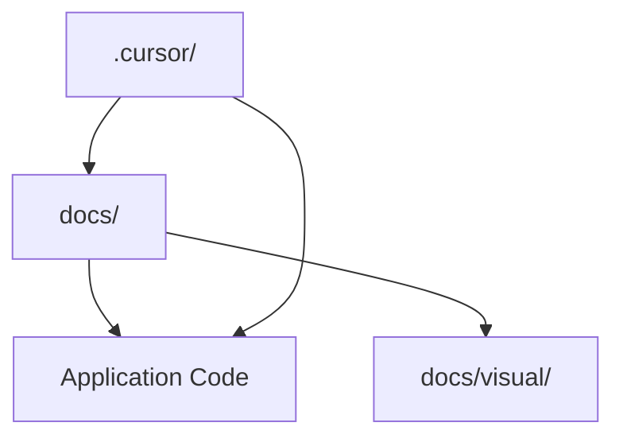

Before editing any folder, check its **`structure.md`** if present.

---

# 5. Documentation System (`docs/`)

All product and architecture documentation lives in **Markdown under `docs/`**.

These documents act as the **single source of truth**.

### Product Design Documentation

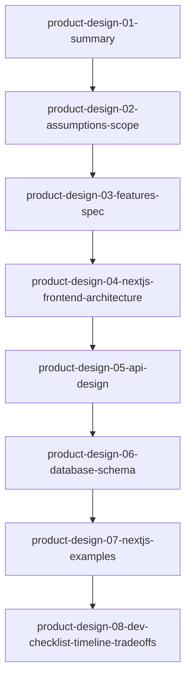

### Documentation Rules

Whenever code changes:

1. Update relevant docs under `docs/`
2. Update `structure.md` if folder structure changes
3. Sync `docs/visual/graph.json` if visual graph is used

---

# 6. Visual Docs Workspace (`docs/visual/`)

The **visual workspace** provides a **React Flow graph editor** for exploring project structure.

The visualization hierarchy:

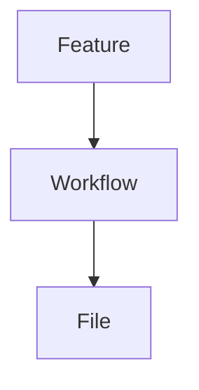

Example:

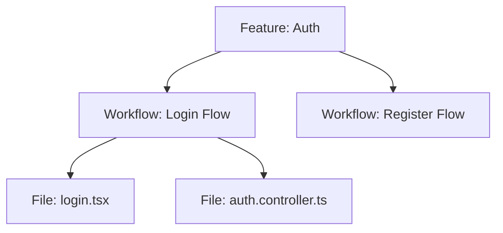

---

## Running the Visual Workspace

```bash
cd docs/visual
npm install
npm run dev
```

Then open:

```
http://localhost:5173
```

---

# Visual Graph Architecture

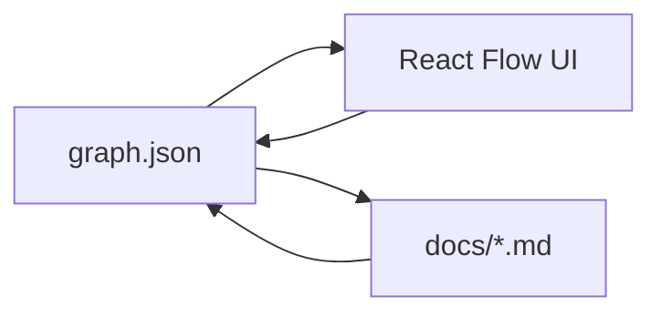

The graph acts as a **visual projection of documentation**.

---

# Docs ↔ Graph Workflow

### Docs → Graph

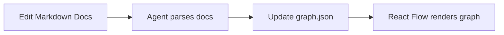

### Graph → Docs

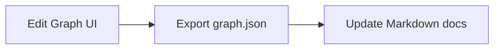

If conflicts occur:

```
Markdown docs always win.
```

---

# 7. Cursor Rules & Skills (`.cursor/`)

The repository includes **Cursor rules and skills** to ensure AI agents behave consistently.

### Rule System

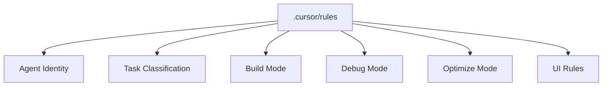

These rules enforce:

* architecture consistency
* UI standards
* documentation updates

---

### Skills

Skills extend agent capabilities.

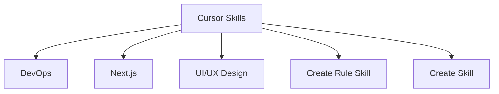

To add a new skill:

1. Copy an existing skill folder
2. Modify its `SKILL.md`
3. Commit to repository

---

# 8. Typical Workflow

### New Feature Development

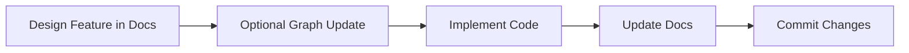

### Refactoring

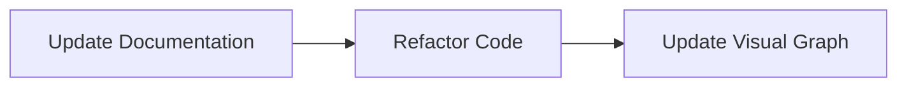

---

# Working With AI Agents

Agents should follow this process:

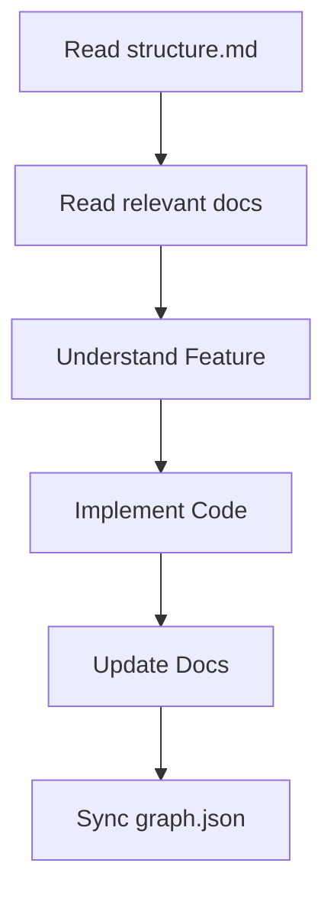

This workflow ensures:

* consistent architecture
* synchronized docs
* predictable AI behavior

---

# Summary

This template ensures that:

* **Markdown docs define the system**
* **React Flow provides visual navigation**
* **Cursor rules guide AI agents**
* **Code stays aligned with documentation**

Result:

A **production-ready template** for teams that want **AI-assisted development without losing control of architecture or documentation**.

